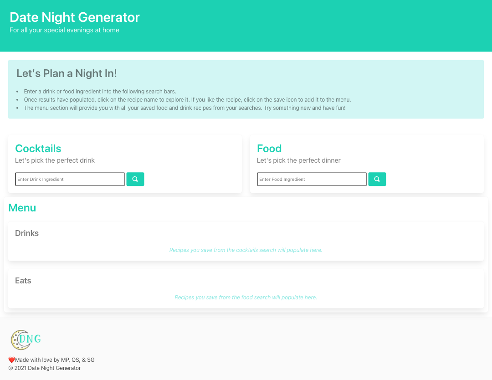
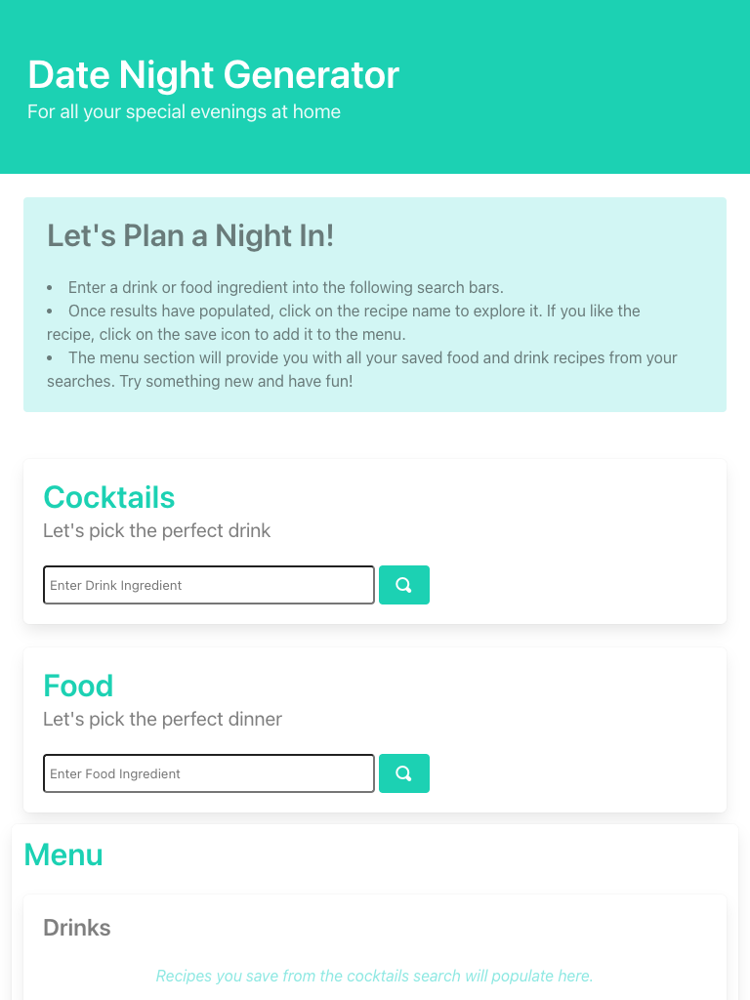
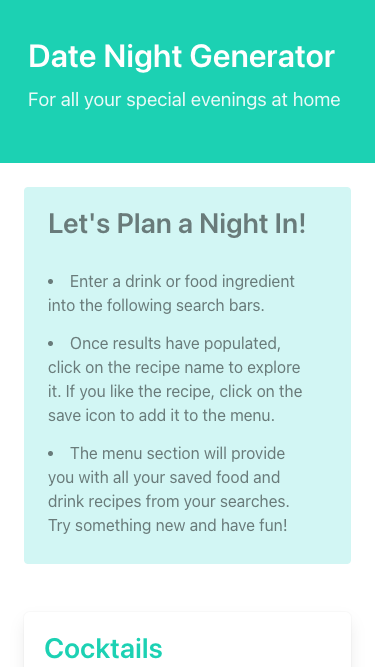

# Project 1: Date Night Generator | MP, QS, SG

For this week's challenge, we developed a simple tool to make date night a little bit easier. 

Table of Contents
* [User Story and Acceptance Criteria](#user-story-and-acceptance-criteria)
* [Key Features](#key-features)
* [Future Improvements](#future-improvements)
* [Links] 
* [Images](#images)

---

## User Story and Acceptance Criteria

### User Story

```
AS A human spending a LOT MORE TIME AT HOME THAN USUAL
I WANT to take the boring planning out of date night
SO THAT I can enjoy more time with the people I care about.
```

### Acceptance Criteria

```
WHEN I open the date night generator 
THEN I see options to search for cocktails and meals.
```
```
WHEN I search by a main alcoholic ingredient
THEN I can select a recipe from a short list of drinks. 
```
```
WHEN I search by a meal category/ingredient
THEN I can select a recipe from a short list of dishes.
```
---

## Key Features

* Responsive layout leveraging ...

---
## Future Improvements

* -
* -

---
## Links

Deployed Application:

GitHub Repository: https://github.com/quaylas/datenightgenerator

---
## Images
### Desktop View
<!-- 
1440px X 1112px



### iPad View

768px X 1024px



### iPhone 6 View

375px X 667px

 -->