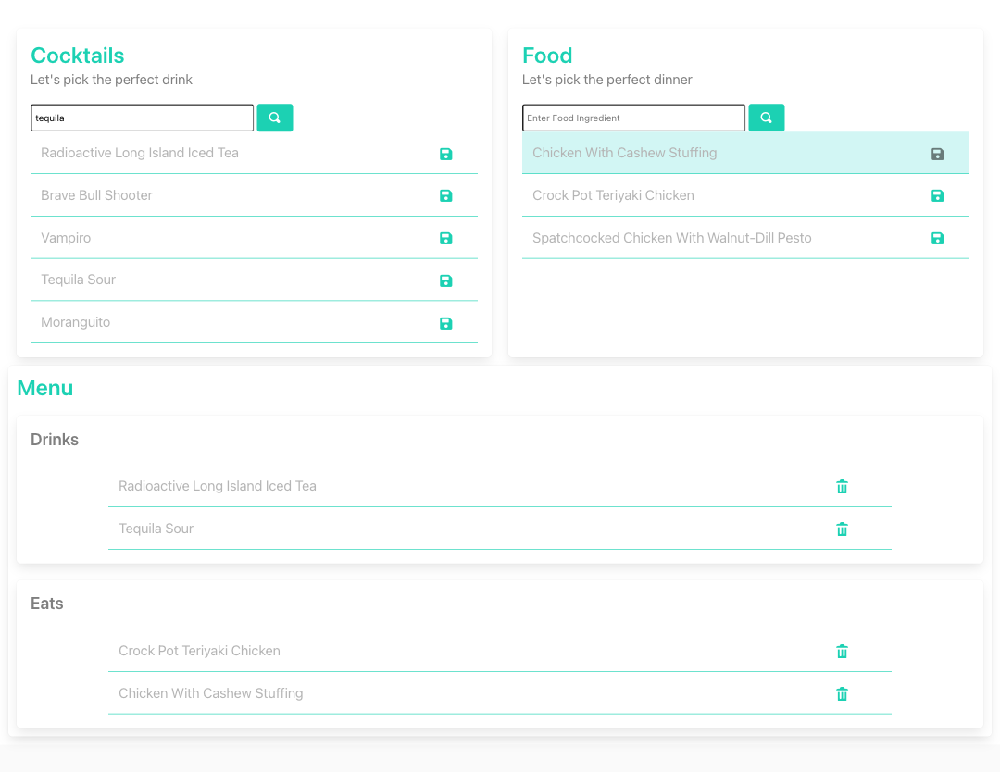

# Project 1: Date Night Generator | MP, QS, SG

For this week's challenge, we developed a simple tool to make date night a little bit easier. 

Table of Contents
* [User Story and Acceptance Criteria](#user-story-and-acceptance-criteria)
* [Key Features](#key-features)
* [Future Improvements](#future-improvements)
* [Links](#links)
* [Images](#images)

---

## User Story and Acceptance Criteria

### User Story

```
AS A human spending a LOT MORE TIME AT HOME THAN USUAL
I WANT to take the boring planning out of date night
SO THAT I can enjoy more time with the people I care about.
```

### Acceptance Criteria

```
WHEN I open the date night generator 
THEN I see options to search for cocktails and meals.
```
```
WHEN I search by a main alcoholic ingredient
THEN I can select a recipe from a short list of drinks. 
```
```
WHEN I search by a meal category/ingredient
THEN I can select a recipe from a short list of dishes.
```
---

## Key Features

* Allows users to input search criteria
* Displays recipes choices inline 
* Allows users to save drink and food recipes to local storage
* Responsive layout leveraging the Bulma CSS Framework.

---
## Future Improvements

* - Expand site to include options for music selection
* - Add alcoholic/non-alcoholic selector for drink recipes
* - Add category selector for food recipes
* - Incorporate drag/drop functionality for menu-building


---
## Links

Deployed Application: https://quaylas.github.io/datenightgenerator/

GitHub Repository: https://github.com/quaylas/datenightgenerator

---
## Images
### Desktop View

1440px X 1112px




### iPad View

768px X 1024px


### iPhone 6 View

375px X 667px


